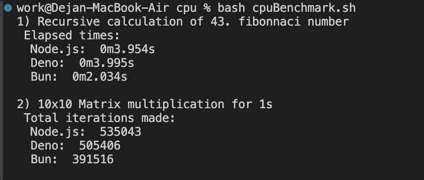

Benchmark pro porovnání výkonu CPU.
Obsahuje 3 soubory:

1. fibonacci.js - program pro porovnání CPU výkonu s velkou paměťovou náročností(rekurze). Konkrétně výpočet 43. čísla fibonacciho posloupnosti.
2. matrixMult.js - program pro porovnání sekvenčního výkonu s nízkou paměťovou náročností. Násobení 10x10 matice.
3. cpuBenchmark.sh - skript s výkonovým testem pro porovnání běhu jednotlivých programů ve všech prostředích.

Ke spuštění výkonového testu použijte příkaz: 
bash cpuBenchmark.sh 

