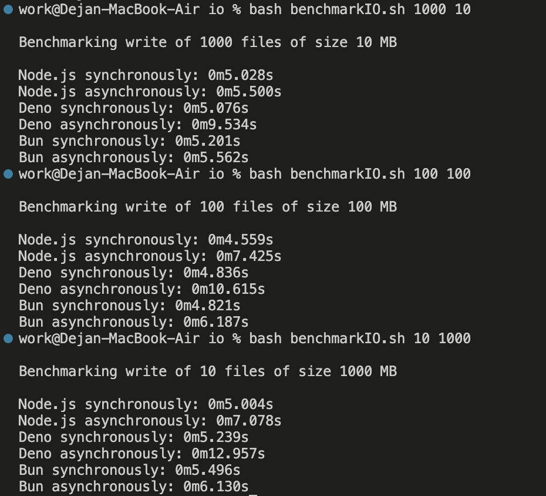

IO výkonové testy pro porovnání synchronních a asynchronních metod pro zapisování suoborů.

Pro každé prostředí jsou napsány 2 programy - jeden synchronní a druhý asynchronní pro zápis souborů.

V souboru benchmarkIO.sh je skript pro spuštění jednotlivých programů ve všech běhových prostředích. 

Použil jsem pro tři různé scénáře:
1) zapsání 10 souborů o jednotlivé velikosti 1GB
2) zapsání 100 souborů o jednotlivé velikosti 100MB
3) zapsání 1000 souborů o jednotlivé velikosti 10MB

Použití: 
bash benchmarkIO.sh 10 1000 
bash benchmarkIO.sh 100 100 
bash benchmarkIO.sh 1000 10 

Výsledky:

