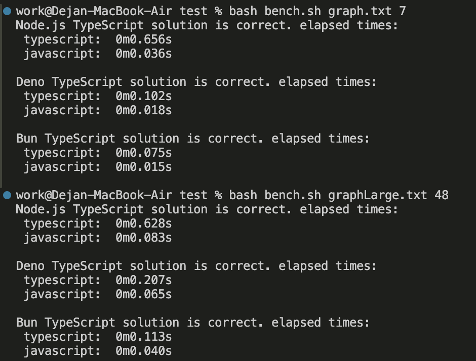

Benchmark pro porovnání Typescript transpilace.
Obsahuje 5 souborů:

1. shortestPath.ts - program pro nalezení nejkratši cesty v grafu
2. node.sh - skript pro kompilaci a spuštění programu v prostření node.js
3. bench.sh - skript s výkonovým testem pro porovnání běhu typescript vs javascript
              programů ve všech prostředích.
4. graph.txt - textová representace malého grafu
5. graphLarge.txt - textová representace velkého grafu

Na prvním řádku souborů s representacemi grafu jsou tři čísla. 
První udává celkový počet hran grafu, druhý a třetí udávají startovní a koncový vrchol.

Benchmarkovací skript ověří i správnost řešení.

Ke spuštění výkonových testů použijte příkazy: 
bash bench.sh graph.txt 7 
bash bench.sh graphLarge.txt 48

